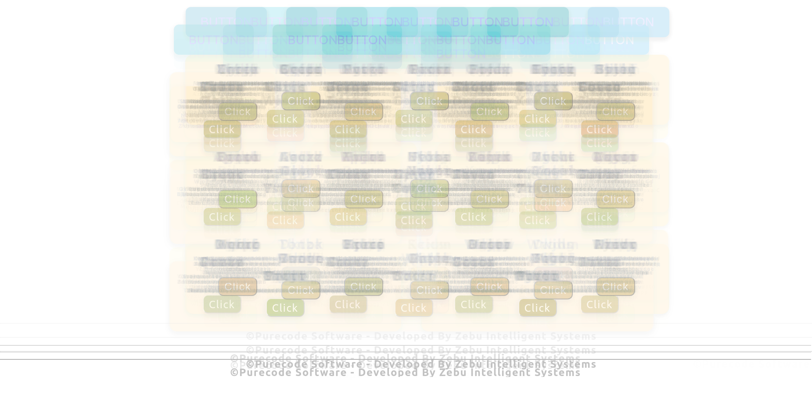
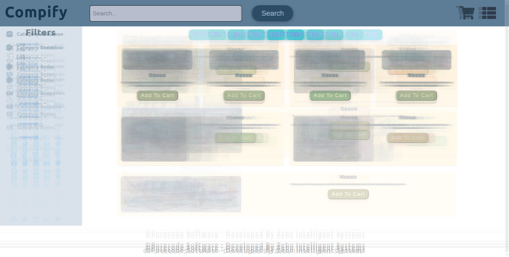
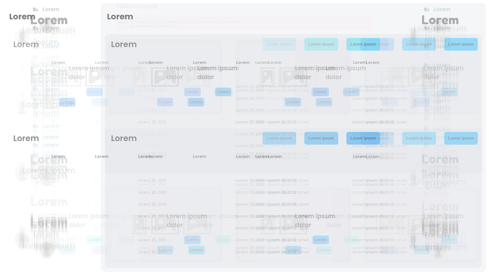
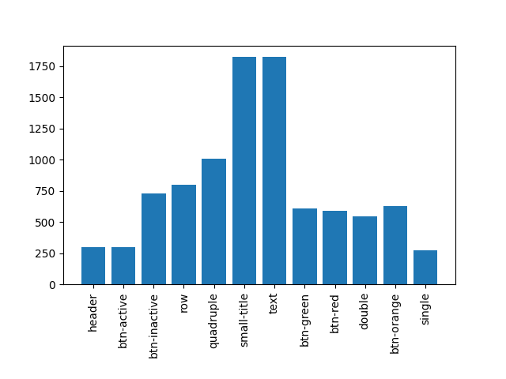
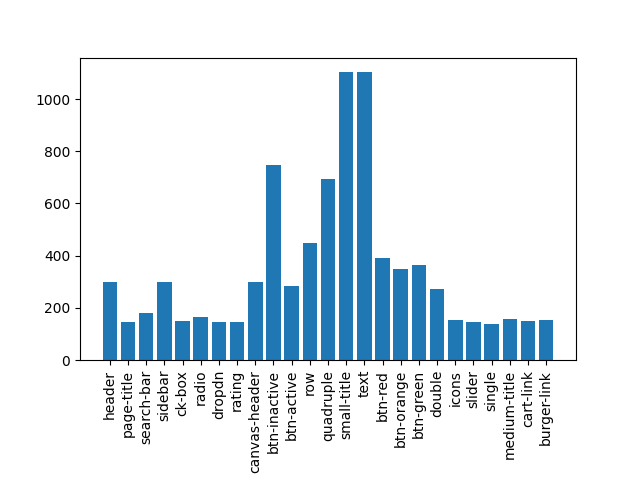
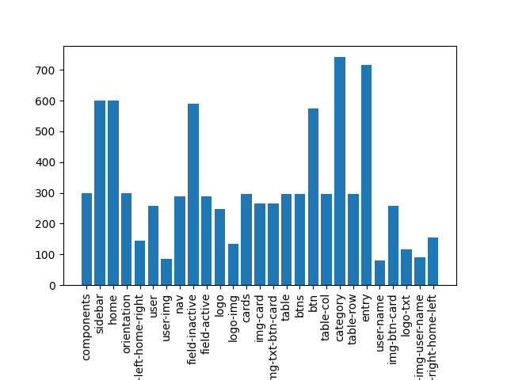

# README

This repo contains code for the purecode assignment.
More details to be added later.

### Task 1: Download the dataset D1, D2 and D3. Each dataset contains 300 (Input: Image, Output: Text) pair samples. Scan
the datasets and give a short description of each dataset.

We can look at the average image from each of the datasets to get an idea of the dataset.

Also a look at the tokens and their count in the corresponding guis.

#### Dataset1: 
A simple dataset with simple structure. We see fewer number of tokens being used here. Finding patterns and structure is trivial. 
#### Dataset2: 
Relatively simple structure, with fixed components in the screen (top bar, side bar). Has more number of tokens.  
#### Dataset3: 
Has a sidebar, one image of a failed render, more complicated tokens and layouts.  

### Task 2: Train any neural network of your choice (one for each dataset). Provide comparative details on three datasets?,

#### Requirements: 
The [requirements](requirements.txt) of the repo in it's current state are mention here the file. 
Overall currently, OpenCV, Matplolib and Sklearn are the only additional libraries being used. Installing these alone will allow for running the code.

#### Dataset1: (Implemented)
Given the simple nature of the dataset using neural networks is an overkill for the task. The task can be very easily achieved using heuristics and trivial image processing. As shown in the code, it is possible to accurately generate all the code for D1. 100% accuracy observed.  
#### Dataset2: (Implementation and results coming soon.)
Dataset is similar to Dataset1 in spirit, and similar techniques can be used to get perfect accuracy here too. It is to be noted that Dataset2 is slightly more complicated and thus will require more logical checks than Dataset1. Nevertheless, it is deterministically possible to 'solve' the given dataset.  
#### Dataset3: (Implementation and results coming soon.)
More involved dataset. While it is deterministically it is possible to obtain perfect results, given the nuanced nature it might be possible to leverage some learning to solve the task. The learning process will definitely benefit from augmentation of data, but that is not as trivial as rotating or flipping the images. If learning appraoch is taken, the task is of image captioning. A standard image captioning model would be the correct place to start. However, given the nature of data that most of the image captioning models are trained, it could be overkill and even complicate learning to fine tune them. The lowlevel features in the dataset are not very complicated ones, and it might be very possible to learn them from much simpler models. Once we have a feautre map, its a task of attending to parts of the image and maps and generate the subsequent text. Again, the text being generated isnt similar to what natural language generation models output, so finetuning can be very tricky. Given the limited number of tokens, it might be worth wile to learn language generation and image features from scratch. These components should be used inside the structure of an image captioning system.

#### How to run:
The `generate_gui` function in [Main.py](src/Main.py) shows an example of running code to generate the gui.
Passing the path of the image, to the instance of the model returns the gui code. 